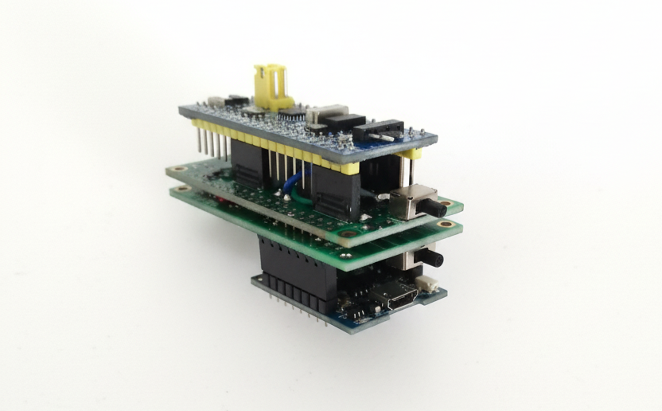

<div align="center">

# ⚡ Ultra-Precision Current and Voltage Measurement System

An embedded system for ultra-precise current and voltage measurement with minimal impact on the Device Under Test (DUT).

<p align="center">
  
  &nbsp; &nbsp;
  
</p>

</div>

## ✨ Features

- **Current Measurement**: 1μA to 100mA
  - Resolution: 1μA (1μA-1mA range), 0.1mA (1mA-100mA range)
- **Voltage Measurement**:  1V to 12V
  - Resolution: 0.1V
- **High-Speed Sampling**: 2kS/s 
- **Real-time Display**:  Shows measurements and mode selection
- **Minimal DUT Impact**: Designed for non-intrusive measurements

---

## 🔧 Hardware

- STM32 Blue Pill (main controller & ADC)
- ESP32/ESP8266 (user interface)
- Ultra-precision current/voltage sensing circuits
- UART communication between STM32 and ESP

---

## 📁 Repository Structure

```
├── implement_stm32_voltage_safety/    # STM32 firmware
├── GUI_ESP32_01/                      # ESP32 interface implementations
├── GUI_ESP32_02/                      # ESP32 interface implementations
├── GUI_ESP8266_01/                    # ESP8266 interface implementation
├── PCB_DESIGN/                        # PCB design files
├── *.pdsprj                           # Proteus circuit simulation files
└── Test_HAL_UART_transmit/            # UART testing code
```

---

## 🚀 Quick Start

1. Flash STM32 with firmware from `implement_stm32_voltage_safety/`
2. Flash ESP32/ESP8266 with GUI code from respective folder
3. Connect STM32 UART to ESP 
4. Power on and connect probes to DUT

---

## 🏗️ System Architecture

```
STM32 → Performs ADC sampling and measurement processing → Sends via UART → ESP32/ESP8266 → Displays real-time values
```

---

## 🔬 Circuit Simulations

Proteus simulation files (`.pdsprj`) and circuit images (`.png`) are included for reference and verification.

---

## ⚠️ Note

This is a precision measurement system.  Proper calibration and careful handling of components are essential for achieving specified accuracy levels.


<div align="center">

</div>
